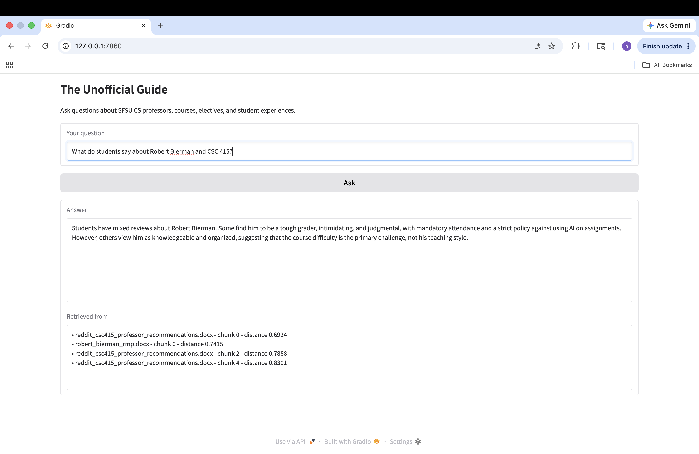
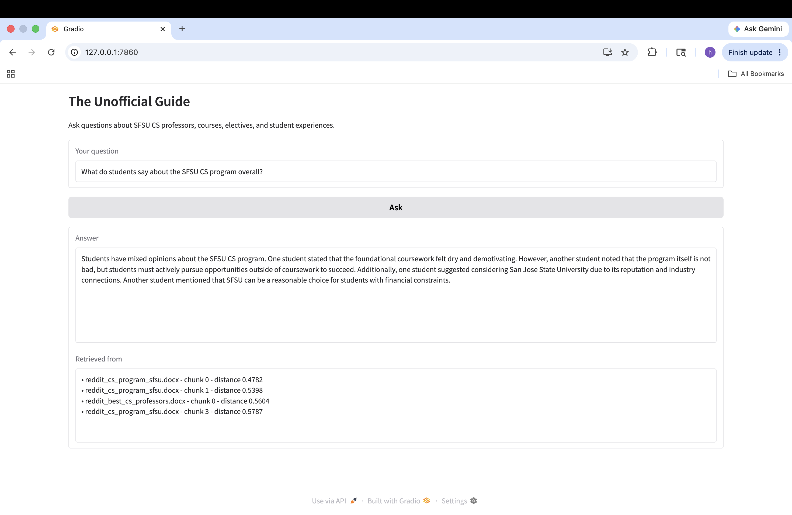
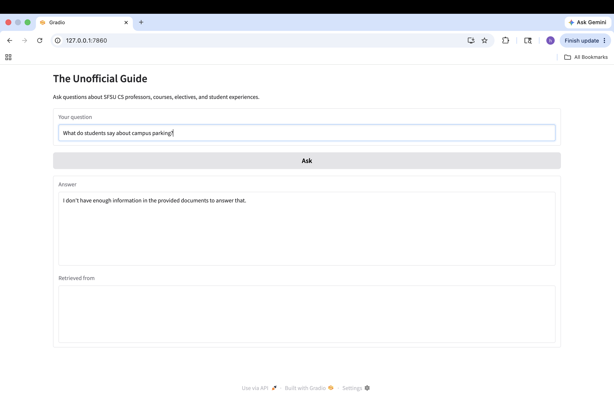

# The Unofficial Guide — Project 1

> **How to use this template:**
> Complete each section *after* you've built and tested the corresponding part of your system.
> Do not write placeholder text — if a section isn't done yet, leave it blank and come back.
> Every section below is required for submission. One-liners will not receive full credit.

---

## Domain

This project focuses on SFSU Computer Science student experiences. The system helps users find information about professors, course difficulty, elective requirements, easy classes, and opinions about the SFSU CS program.

This knowledge is valuable because official university resources only provide course descriptions and degree requirements. They do not provide student opinions about workload, teaching quality, grading style, or recommendations for specific professors and courses. Students often rely on unofficial sources such as Reddit and Rate My Professors to make academic decisions.

---

## Document Sources

| # | Source | Type | URL or file path |
|---|--------|------|-----------------|
| 1 |Anthony Souza Reviews| Rate My Professors |data/raw/anthony_souza_rmp.docx
  2 |Duc Ta Reviews |Rate My Professors	|data/raw/duc_ta_rmp.docx
  3 |Jose Ortiz-Costa Reviews	|Rate My Professors	|data/raw/jose_ortiz_costa_rmp.docx
  4 |Matt Pico Reviews |Rate My Professors |data/raw/Matt_pico_rmp.docx
  5 |Robert Bierman Reviews| Rate My Professors| data/raw/robert_bierman_rmp.docx
  6 |Best CS Professors Discussion| Reddit r/SFSU	| data/raw/reddit_best_cs_professors.docx
  7 |CS Elective Requirements Discussion|Reddit r/SFSU	| data/raw/reddit_cs_elective_requirements.docx
  8 |SFSU CS Program Discussion| Reddit r/SFSU| data/raw/reddit_cs_program_sfsu.docx
  9 |CSC 415 Professor Recommendations	|Reddit r/SFSU	| data/raw/reddit_csc415_professor_recommendations.docx
  10 |Easy Classes at SFSU| Reddit r/SFSU| data/raw/reddit_easy_classes_sfsu.docx 
## Chunking Strategy

**Chunk size:**

350 characters

**Overlap:**

75 characters

**Why these choices fit your documents:**

The documents consist primarily of short reviews, Reddit comments, and student discussions. Smaller chunks preserve individual opinions and recommendations without mixing unrelated content. Overlap was added to preserve context when important information appears near chunk boundaries.

**Final chunk count:**

56 chunks

## Sample Chunks

### Chunk 1
Source: duc_ta_rmp.docx

Professor: Duc Ta
Can't wait to take the next 2 courses with Professor Ta! The only professor who is always positive and productive, even during this sad time at State U, despite continued destructive budget cuts and historic ad"
  
### Chunk 2
Source: robert_bierman_rmp.docx

Professor: Robert Bierman
Professor Bierman is a TOUGH grader. And is extremely intimidating. Will randomly call on you in class and judges you for answering incorrectly. Attendance is mandatory as well. Gives you a 1 on assignments if you use AI.

### Chunk 3
Source: reddit_cs_elective_requirements.docx

A student replied that the 12 units of computer science electives are required for graduation. The response also noted that some previously completed courses may count toward elective

### Chunk 4
Source: reddit_cs_program_sfsu.docx

Students stated that the program is not bad, but students must actively pursue opportunities outside coursework

### Chunk 5
Source: reddit_easy_classes_sfsu.docx

Easiest Classes at SFSU Date Collected: June 2026 Original Question: A student needed an additional 3-unit course to maintain financial aid eligibility and asked for recommendations for easy classes that required minimal effort and attendance.

---

## Embedding Model

**Model used:**

Model used: all-MiniLM-L6-v2 via sentence-transformers

**Production tradeoff reflection:**

I selected all-MiniLM-L6-v2 because it is free, lightweight, and runs locally without requiring an API key. It performs well on short opinion-based text such as reviews and Reddit discussions. For a production system, I would evaluate larger embedding models that provide better semantic accuracy, support multilingual text, and handle larger document collections. I would also consider latency, inference cost, and scalability.

---

## Retrieval Test Results

### Query 1
What do students say about Robert Bierman and CSC 415?

Top Results:
1. reddit_csc415_professor_recommendations.docx
 - Discusses student opinions about CSC 415, including comments that the course is    difficult but organized.
 - Mentions that Robert Bierman is knowledgeable and experienced.
2. robert_bierman_rmp.docx
 - Contains Rate My Professors reviews describing Bierman as a tough grader and strict instructor.
3. reddit_csc415_professor_recommendations.docx
 - Includes discussion about Bierman’s teaching style and why some students criticize it.

Why Relevant:
These chunks directly discuss Robert Bierman and CSC 415.

### Query 2
Are CS students required to complete 12 units of electives?

Top Results:
1. reddit_cs_elective_requirements.docx
 - States that 12 units of CS electives are required for graduation.
2. reddit_cs_elective_requirements.docx
 - Explains that some previously completed courses may count toward elective requirements.
3. reddit_cs_elective_requirements.docx
 - Provides context about degree progress reports and curriculum requirements.

Why Relevant:
All retrieved chunks come from the exact document discussing elective requirements. The answer is explicitly stated in the retrieved text, making retrieval highly accurate.

### Query 3
What do students say about the SFSU CS program overall?

Top Results:
1. reddit_cs_program_sfsu.docx
 - Discusses student opinions about the quality of the SFSU CS program.
2. reddit_cs_program_sfsu.docx
 - Mentions career preparation, projects, and interview preparation.
3. reddit_best_cs_professors.docx
 - Contains comments about the CS curriculum and student experiences.

Why Relevant:
These chunks discuss the strengths and weaknesses of the SFSU CS program, including career preparation, curriculum quality, and student experiences. They directly address the user's question.

## Grounded Generation

**System prompt grounding instruction:**
System prompt grounding instruction:

The prompt explicitly instructs the model:

"Answer the user's question using ONLY the provided context. Do not use outside knowledge. If the context does not contain enough information to answer, say: 'I don't have enough information in the provided documents to answer that.'"

A distance threshold was also used to reject weak retrievals before generation.

**How source attribution is surfaced in the response:**

Source attribution is generated programmatically rather than relying on the LLM. After generation, the system displays the source filename, chunk number, and retrieval distance for every retrieved chunk used to answer the question.

## Example Responses

### Example 1: Robert Bierman and CSC 415

Question:
What do students say about Robert Bierman and CSC 415?

Summary:
The system reported mixed reviews, noting that Bierman is strict but knowledgeable and organized.

Sources: 
- reddit_csc415_professor_recommendations.docx 
- robert_bierman_rmp.docx 

## Example 2: SFSU CS Program

Question:
What do students say about the SFSU CS program overall?

Summary:
The system reported that students have mixed opinions about the SFSU CS program. Some students believe the program is useful but requires significant effort outside coursework, including projects, internships, interview preparation, and technical skill development. Other students mentioned that SFSU can be a reasonable choice for students with financial constraints, while some recommended considering universities with stronger industry connections.

Sources:
- reddit_cs_program_sfsu.docx
- reddit_best_cs_professors.docx

### Example 3: Out-of-Scope Query

Question:
What do students say about campus parking?

Summary:
The system correctly refused to answer because the documents do not contain information about parking.

---
## Query Interface

Input:
A text box where users enter questions about SFSU CS professors, courses, and student experiences.

Output:
1. Generated answer
2. Source citations
3. Retrieved document references

Sample Interaction:

Question:
Are CS students required to complete 12 units of electives?

Answer:
Yes, CS students are required to complete 12 units of electives for graduation.

Sources:
reddit_cs_elective_requirements.docx

## Evaluation Report

Evaluation Report

#	Question	Expected answer	System response (summarized)	Retrieval quality	Response accuracy
1. What do students say about Robert Bierman and CSC 415?	
Students describe CSC 415 as difficult, but Bierman is knowledgeable and organized.	
System reported mixed reviews, noting that Bierman is strict but knowledgeable and organized.	Relevant	Accurate
2. Are CS students required to complete 12 units of electives?	
Yes, 12 units are required.	
System correctly stated that CS majors must complete 12 units of electives.	
Relevant	Accurate
3. What do students say about the SFSU CS program overall?	
Students believe success depends heavily on effort outside coursework.	
System summarized mixed opinions and emphasized projects, internships, and interview preparation.	
Relevant	Accurate
4. Which professor is praised as helpful by students?	
Anthony Souza, Duc Ta, and Jose Ortiz-Costa receive positive reviews.	
System retrieved positive reviews and summarized them, but generalized slightly.	
Relevant	Partially Accurate
5. What do students say about campus parking?	
No information exists in the dataset.	
System declined to answer and stated that the documents did not contain enough information.	
Off-target retrieval but correctly rejected	Accurate

**Retrieval quality:** Relevant / Partially relevant / Off-target  
**Response accuracy:** Accurate / Partially accurate / Inaccurate

---

## Failure Case Analysis

<!-- Identify at least one question where retrieval or generation did not work as expected.
     Write a specific explanation of *why* it failed, tied to a part of the pipeline.

     "The answer was wrong" is not an explanation.

     "The relevant information was split across a chunk boundary, so retrieval returned
     only half the context — the model didn't have enough to answer correctly" is an explanation.

     "The embedding model treated the professor's nickname as out-of-vocabulary and returned
     results from an unrelated review" is an explanation. -->

**Question that failed:**

Which professor is praised as helpful by students?

**What the system returned:**

The system correctly retrieved positive reviews for Anthony Souza, Duc Ta, and Jose Ortiz-Costa. However, the generated answer stated that all professors mentioned in the retrieved context were praised as helpful, rather than specifically identifying which professors received positive feedback.

**Root cause (tied to a specific pipeline stage):**

This issue occurred primarily in the generation stage. The retrieval stage worked correctly and returned relevant professor review chunks. However, the LLM summarized multiple positive reviews too broadly and overgeneralized the information. Instead of naming the professors individually, it combined the retrieved evidence into a more generic statement.

**What you would change to fix it:**

To improve the result, I would modify the prompt to require the model to explicitly list the professors mentioned in the retrieved chunks and summarize each one separately. I would also experiment with retrieving fewer chunks or applying stronger filtering to reduce opportunities for overgeneralization.

---

## Spec Reflection

**One way the spec helped you during implementation:**

The planning document helped determine the chunking strategy, retrieval design, evaluation questions, and overall system architecture before coding began. Having these decisions documented made implementation easier and reduced unnecessary changes during development.

**One way your implementation diverged from the spec, and why:**

The original plan used 500-character chunks with 100-character overlap. After inspecting retrieval results, I reduced the chunk size to 350 characters and overlap to 75 characters. This increased the total number of chunks and improved retrieval quality for short review-style documents.

---

## AI Usage

<!-- Describe at least 2 specific instances where you used an AI tool during this project.
     For each: what did you give the AI as input, what did it produce, and what did you
     change, override, or direct differently?

     "I used Claude to help me code" is not sufficient.
     "I gave Claude my Chunking Strategy section from planning.md and asked it to implement
     chunk_text(). It returned a function using a fixed character split. I overrode the
     chunk size from 500 to 200 because my documents are short reviews, not long guides." -->

**Instance 1**

- *What I gave the AI:*

I provided my document structure, including the .docx files stored in data/raw/, my chunking strategy from planning.md, and the requirement to create a document ingestion pipeline.

- *What it produced:*

The AI generated Python code using python-docx to load Word documents, clean the text, and split the documents into chunks using a fixed chunk size and overlap.

- *What I changed or overrode:*

I tested the initial chunking results and found that the original chunk size produced too few chunks. I changed the chunk size from 500 characters with 100-character overlap to 350 characters with 75-character overlap, increasing the total chunk count from 38 to 56 and improving retrieval quality.

**Instance 2**

- *What I gave the AI:*

I provided my retrieval approach from planning.md, which specified using all-MiniLM-L6-v2, ChromaDB, and top-k retrieval.

- *What it produced:*

The AI generated code for embedding document chunks, storing them in ChromaDB, retrieving the top matching chunks, and connecting the retrieval pipeline to Groq's llama-3.3-70b-versatile model for answer generation.

- *What I changed or overrode:*

After testing retrieval, I observed that some out-of-scope questions still retrieved weakly related chunks. I added a retrieval distance threshold before generation so that questions with only weak matches would return "I don't have enough information in the provided documents to answer that" instead of generating an unsupported answer.